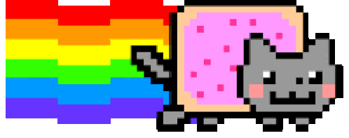

  <h2>Hi, I'm Jnanadeep, Cybersecurity Enthusiast.</h2>
  

    <a href="https://jnanadeep.vercel.app/">Portfolio</a> • 
    <a href="https://tryhackme.com/p/JDx17/">Tryhackme</a> • 
    <a href="mailto:jnanadeepr2005@gmail.com">E-Mail</a> • 
    <a href="https://www.linkedin.com/in/jnanadeep-r-3b924b384/">LinkedIn</a>
  

 

  
✦ Tech Stack ✦

  

   

  
✦ Cybersecurity ✦

 

  <table style="border-collapse: collapse; border: none;">
    <tr>
      <td width="60%" valign="top" style="border: none;">
        <h3>About Me</h3>
        <ul>
          <li>Engineering student focused on cybersecurity, systems, and low-level technologies.</li>
          <li>Exploring offensive security, vulnerability research, and security tooling.</li>
          <li>Practicing through labs and hands-on security projects.</li>
          <li>Outside tech, I enjoy sketching and screenwriting.</li>
        </ul>
         
      </td>
    </tr>
  </table>

  

  ⋯ Time is a fake concept. ⋯

